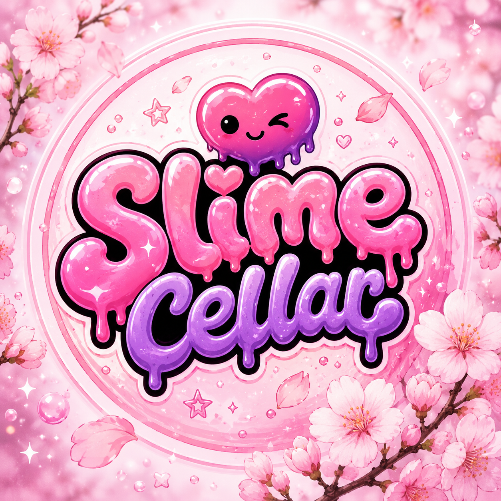

<!DOCTYPE html>
<html lang="en">
<head>
<meta charset="UTF-8" />
<meta name="viewport" content="width=device-width, initial-scale=1.0" />
<title>Slime Cellar</title>

</head>

<body>

<header>
  <!-- Replace logo.png with your logo image link -->
  
  <h1>Slime Cellar</h1>
  
Handmade scented slime with mystery charms inside.

  

    <a class="btn" href="#shop">Shop Slime</a>
    <a class="btn secondary" href="#locator">Find In Stores</a>
  

</header>

<section class="mystery">
  <h2>Collect the Mystery Charms</h2>
  
Every slime container comes with 1 mystery charm inside. Try to collect them all!

</section>

<section id="shop">
  <h2 class="section-title">Shop Our Slime</h2>
  

    Soft, stretchy, scented slime made in small batches. Pick your favorite flavor and see what mystery charm you get.
  

  

    

      
🍓

      Mystery Charm Included
      <h3>Strawberry Slime</h3>
      
Sweet strawberry scented slime.

      
$7.99

      <a class="btn" href="#">Buy Now</a>
    

    

      
🍇

      Mystery Charm Included
      <h3>Jasmine Purple Slime</h3>
      
Soft purple slime with a jasmine scent.

      
$7.99

      <a class="btn" href="#">Buy Now</a>
    

    

      
🍉

      Mystery Charm Included
      <h3>Watermelon Slime</h3>
      
Fresh watermelon scented slime.

      
$7.99

      <a class="btn" href="#">Buy Now</a>
    

    

      
✨

      Mystery Charm Included
      <h3>Mystery Slime</h3>
      
Surprise scent, surprise charm, full mystery.

      
$7.99

      <a class="btn" href="#">Buy Now</a>
    

  

</section>

<section id="locator">
  <h2 class="section-title">Store Locator</h2>
  

    Want to grab Slime Cellar in person? Find us at these locations.
  

  

    

      <h3>House of Wine and Spirits</h3>
      
<strong>Location:</strong> San Marcos, CA

      
<strong>Available:</strong> Slime Cellar products

      <a class="map-btn" href="https://www.google.com/maps/search/House+of+Wine+and+Spirits+San+Marcos+CA" target="_blank">Open Map</a>
    

    

      <h3>Old Poway Market</h3>
      
<strong>Location:</strong> Poway, CA

      
<strong>Available:</strong> Slime Cellar products

      <a class="map-btn" href="https://www.google.com/maps/search/Old+Poway+Market+Poway+CA" target="_blank">Open Map</a>
    

  

</section>

<section>
  <h2 class="section-title">Wholesale / Store Requests</h2>
  

    Want Slime Cellar in your store? Contact us for wholesale pricing and local delivery options.
  

  

    <a class="btn" href="tel:6197154575">Call 619-715-4575</a>
    <a class="btn secondary" href="https://instagram.com/" target="_blank">Follow Us</a>
  

</section>

  
© 2026 Slime Cellar. All rights reserved.

  
Handmade slime. Not edible. Keep away from small children.

</body>
</html>
